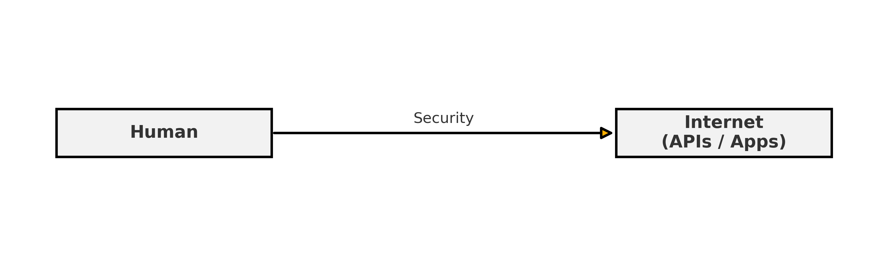
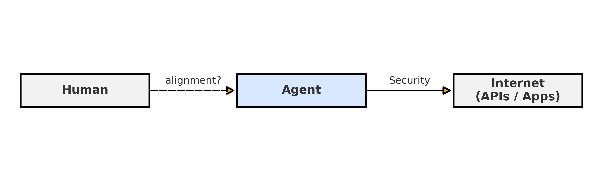
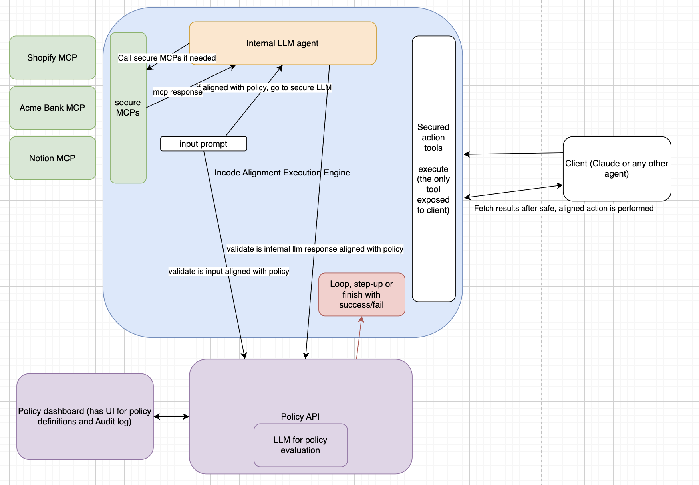

# PolicyGuard AI ▸ Agent Identity & Alignment Gateway





A lightweight gateway that:
* Verifies **who** controls an autonomous agent (step-up IDV)
* Checks **what** the agent is allowed to do (natural-language policy engine)
* Audits every prompt & tool call in an immutable log

## Directory Structure

- **aligned-execution-engine/**: Service with feedback loop to perform reliable agentic operations and block malicious operations
- **demo/**: MCP server Java implementation of a fictional bank
- **diagrams/**: Architecture and security flow diagrams
- **friendly-ui-replicator-clone/**: React Vite app representing the approval screen interface
- **idv-mcp/**: Identity verification server integrated with 3rd party Identity Verification API
- **visual-clone-ui-wizard/**: Bank dashboard application developed in Loveable


---

## 1 · Features

| Pillar | What it gives you |
|--------|------------------|
| **Policy API** (FastAPI) | `allow | deny | idv` decision in \<300 ms |
| **IDV hook** | Redirect to Incode (or any link) when decision = `idv` |
| **SQLite Audit** | Full prompt + action history (`/logs`) |
| **Dashboards** | • Streamlit: ops console<br>• React: production-ready UI |
| **Smoke tests** | One script + pytest suite for CI |

---

## 2 · Quick Start (Local)

```bash
git clone <repo-url> policyguard
cd policy-api
python -m venv venv && source venv/bin/activate
pip install -r requirements.txt
export OPENROUTER_API_KEY=sk-...           # or OPENAI_API_KEY
uvicorn main:app --reload            # API on http://127.0.0.1:8000
streamlit run policy_dashboard.py          # dashboard on http://localhost:8501